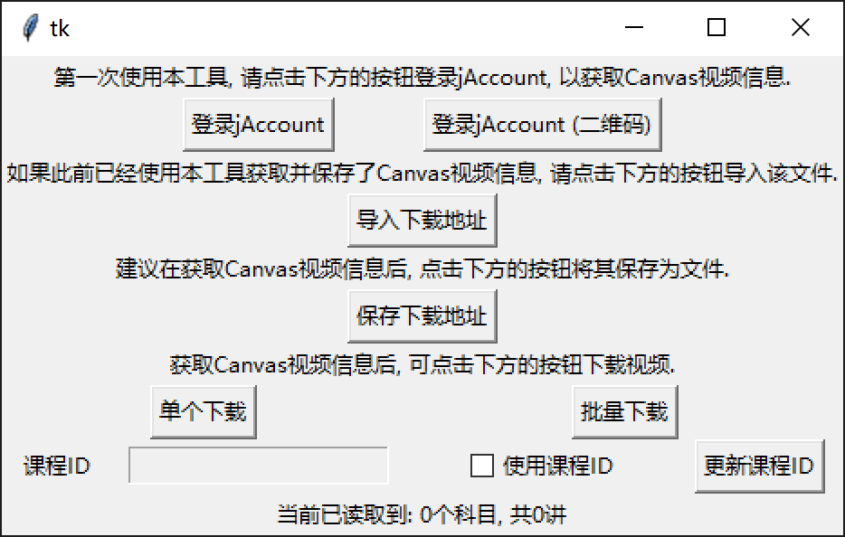

## SJTU Canvas 视频下载器

Fork 自 [prcwcy/sjtu-canvas-video-download](https://github.com/prcwcy/sjtu-canvas-video-download)，在其基础上做了稳定性、界面与易用性的全面重构。

### 主界面展示



### 与原版（上游主仓库）的区别

**稳定性**
- 新增 `sjtu_http.py`：带 `urllib3.Retry`（连接/读/状态重试 + 退避）的共享 `requests.Session`，根治偶发的 `SSL UNEXPECTED_EOF_WHILE_READING` 崩溃。
- `RealCourseV2` / `Course` 改为优先读取列表记录里的本地元数据（`courName`/`subjName`/`userName`），仅在需要播放地址时才联网；下拉框从「每节课各发一次请求」降为 0 次请求，既快又稳。
- 全部网络调用统一走重试 Session，默认 30s 超时。

**界面重构**
- 由原版「主窗口 + 多个浮动子窗口」收敛为**单窗口 + 侧边栏导航**（登录 / 下载 / 历史），层级清晰。
- 新增 `sjtu_style.py` 统一设计系统：浅色画布 + 白色卡片 + 单一蓝色主行动色 + 深色侧边栏，统一字体/间距/按钮/输入控件；登录页用标签页切换「账号密码 / 扫码」。
- 去掉界面上所有 `V1/V2` 等版本字样。

**下载流程简化**
- 只保留「按课程 ID 下载」：输入 `oc.sjtu.edu.cn` 课程 ID（如 `90553`）→ 失焦自动加载全部讲次 → 一键下载；去掉原版的「单个下载 / 批量下载」切换与「导入 / 导出下载地址」。
- 保留「只下载录像（不下载录屏）」选项。
- 课程加载、取视频地址、aria2 下载均放到**后台线程**，解决 macOS 上 `subprocess.run` 阻塞导致整个界面冻结的问题。

**健壮性**
- 登录页 / 扫码页网络失败不再让整个程序崩溃，改为弹窗提示并可重试。
- 下载链接生成兼容两种数据 schema（`cdviViewNum` 缺失时自动走兜底分支）。
- 历史页时间解析修正（纳秒级时间戳），并改为卡片化滚动列表。

**启动方式**
- 新增 `start.command`：macOS 下双击即可启动，自动复用 `.venv`、缺失 `aria2` 时自动 `brew install`。

### 使用说明

课程ID（取 `oc.sjtu.edu.cn/courses/` 后面的数字）：


#### macOS

双击项目根目录的 `start.command` 即可。首次会自动创建虚拟环境并安装依赖。

#### 非 Windows 用户（源码运行）

以 Ubuntu 20.04 为例，安装 `python3`、`python3-pip`：

```sh
sudo apt install python3
sudo apt install python3-pip
```

安装依赖：

```sh
pip3 install -r requirements.txt
```

还需 `python3-tk`、`python3-pil.imagetk`、`aria2`：

```sh
sudo apt install python3-tk
sudo apt install python3-pil.imagetk
sudo apt install aria2
```

启动：

```sh
python3 main.py
```
